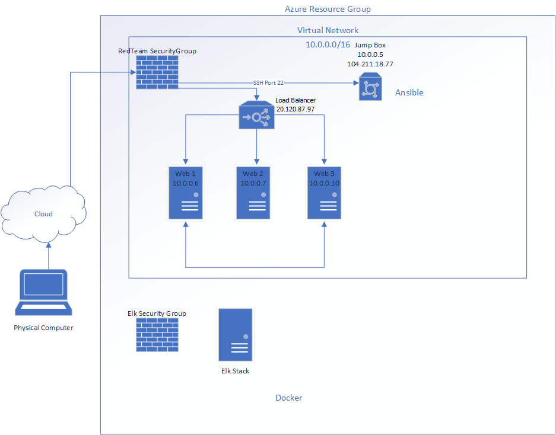
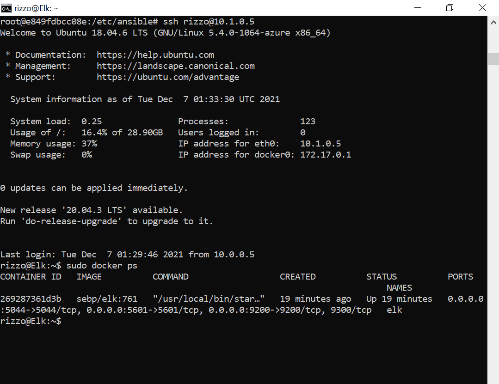

## Automated ELK Stack Deployment

The files in this repository were used to configure the network depicted below.



These files have been tested and used to generate a live ELK deployment on Azure. They can be used to either recreate the entire deployment pictured above. Alternatively, select portions of the yaml file may be used to install only certain pieces of it, such as Filebeat.

  - [Install Docker](/YAML/install-docker.yml)
  - [Install FileBeat](/YAML/filebeat.yml)
  - [Install MetricBeat](/YAML/metricbeat.yml)

Download the _ansible.cfg_ from https://ansible.com and edit to your config or copy [Ansible Configuration](/Ansible/ansible.cfg) to /etc/ansible
  - For ansible.cfg edit:
    ```bash
    cd /etc/ansible
    nano ansible.cfg
    change 'remote_user = admin'
    ```

Assign username and SSH Public Key for Web1, Web2, Web3, and Elk in Azure Portal. 
  - Web1, Web2, Web3, and Elk | Reset Password | Reset SSH Public Key
    ```bash
    username: admin
    SSH Key: copy id_rsa.pub from ansible docker container in ~/.ssh/id_rsa.pub
    ```
  - Generate SSH Key
    ```bash
    cd ~/.ssh
    ssh-keygen (Press Enter for all)
    cat id_rsa.pub
    ```

This document contains the following details:
- Description of the Topology
- Access Policies
- ELK Configuration
  - Beats in Use
  - Machines Being Monitored
- How to Use the Ansible Build


### Description of the Topology

The main purpose of this network is to expose a load-balanced and monitored instance of DVWA, the D*mn Vulnerable Web Application.

Load balancing ensures that the application will be highly avaliable, in addition to restricting access to the network.
- Load balancers protect the avaliablitly of applications. Should one server go down or recieve too many requests the load balancer redirects traffic to other servers with the exact same data. 
- Using a jumpbox has many advantages to it. Some of the main advantages are security, automation, and access control. A jumpbox allows the main machines to not be directly accessible, requiring first to connect to the jumpbox before making a connection to the machines. This makes it harder for attackers because there is only one heavily gaurded entry point. This also allows you to control who can and can not connect to the machines. Another adavantage is that it allows you to automate the other machines. Instead of updating and install applications on each machine individualy you can use software such as ansible to install the same thing on multiple machines very easily.  


Integrating an ELK server allows users to easily monitor the vulnerable VMs for changes to the data and system logs.
- Filebeat monitors the log files and locations specified, collects log events, and then forwards them to ElastcSearch.
- Metricbeat takes metrics and statisticts that is has collected and sends them to ElasticSearch

The configuration details of each machine may be found below.


| Name     | Function | IP Address (Private \ Public) | Operating System |
|----------|----------|------------|------------------|
| Jump Box | Gateway  | 10.0.0.5 \ 104.211.18.77   | Linux            |
| Web 1    | DWVA     | 10.0.0.6   | Linux            |
| Web 2    | DVWA     | 10.0.0.7   | Linux            |
| Web 3    | DVWA     | 10.0.0.10  | Linux            |
| Elk      | Elk Stack| 10.1.0.5 \ 52.159.72.249   | Linux            |
| LoadBalancer      | Balance Work Load| \ 20.120.87.97   | Linux            |

### Access Policies

The machines on the internal network are not exposed to the public Internet. 

Only the jumpbox machine can accept connections from the Internet. Access to this machine is only allowed from the following IP addresses:
- _TODO: Add whitelisted IP addresses_

Machines within the network can only be accessed by anisble.
- _TODO: Which machine did you allow to access your ELK VM? What was its IP address?_

A summary of the access policies in place can be found in the table below.

| Name     | Publicly Accessible | Allowed IP Addresses |
|----------|---------------------|----------------------|
| Jump Box | Yes                 | 10.0.0.1 10.0.0.2    |
|          |                     |                      |
|          |                     |                      |

### Elk Configuration

Ansible was used to automate configuration of the ELK machine. No configuration was performed manually, which is advantageous because...
- _TODO: What is the main advantage of automating configuration with Ansible?_

The playbook implements the following tasks:
- Increase System Memory
  ```yaml
  - name: Set vm.max_map_count to 262144
    systemctl:
      name: vm.max_map_count
      value: '262144'
      state: present
      reload: yes
  ```
- Install Services
  ```bash
      `docker.io`
      `python3-pip`
      `docker` through pip
- Launch container with exposed ports
  ```bash
  `5601:5601`
  `9200:9200`
  `5044:5044`
  ```

The following screenshot displays the result of running `docker ps` after successfully configuring the ELK instance.



### Target Machines & Beats
This ELK server is configured to monitor the following machines:
- _TODO: List the IP addresses of the machines you are monitoring_

We have installed the following Beats on these machines:
- _TODO: Specify which Beats you successfully installed_

These Beats allow us to collect the following information from each machine:
- _TODO: In 1-2 sentences, explain what kind of data each beat collects, and provide 1 example of what you expect to see. E.g., `Winlogbeat` collects Windows logs, which we use to track user logon events, etc._

### Using the Playbook
In order to use the playbook, you will need to have an Ansible control node already configured. Assuming you have such a control node provisioned: 

SSH into the control node and follow the steps below:
- Copy the _____ file to _____.
- Update the _____ file to include...
- Run the playbook, and navigate to ____ to check that the installation worked as expected.

_TODO: Answer the following questions to fill in the blanks:_
- _Which file is the playbook? Where do you copy it?_
- _Which file do you update to make Ansible run the playbook on a specific machine? How do I specify which machine to install the ELK server on versus which to install Filebeat on?_
- _Which URL do you navigate to in order to check that the ELK server is running?

_As a **Bonus**, provide the specific commands the user will need to run to download the playbook, update the files, etc._